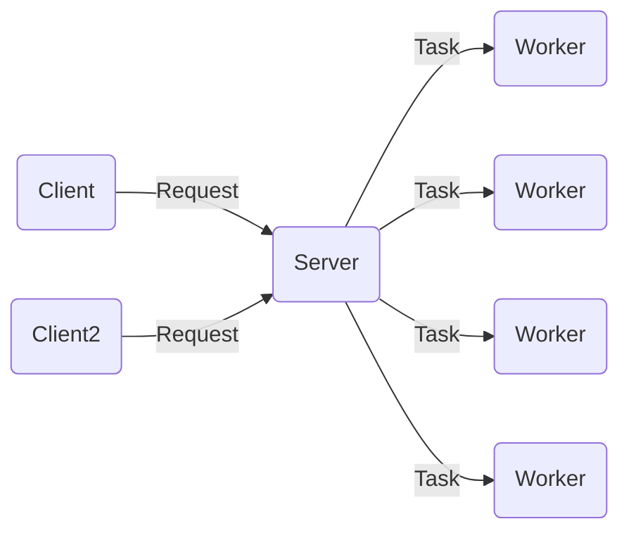
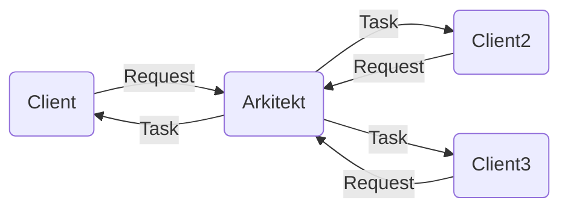

# Quick Start

Let's discover **Arkitekt in less than 5 minutes**.

### Inspiration

Arkitekt tries to help in the automation of complex analysis pipelines. It is designed for task
distribution amongst **untrusted** and **unsteady** workes. What do we mean by this?

#### Arkitekt vs Celery

Arkitekt takes heavy inspiration from RPC Frameworks like Celery but has a completely different approach.
Whereas Celery tries to offload tasks on workers in the background of a server. Arkitekt tries to schedule
work on the clients conneted to said worker.

**Celery**:



**Arkitekt**:



### Trust Issues

With this sort of layout comes one essential problem.. **Trust!**

### Installation

```bash
pip install rath
```

## Initilization

```python
from rath.links.aiohttp import AioHttpLink

link = AioHttpLink(url="https://api.spacex.land/graphql/")


rath = Rath(link=link)

query = """query TestQuery {
  capsules {
    id
    missions {
      flight
    }
  }
}
"""

result = rath.execute(query)
```
