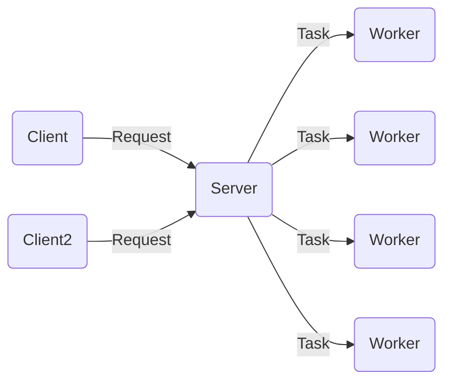
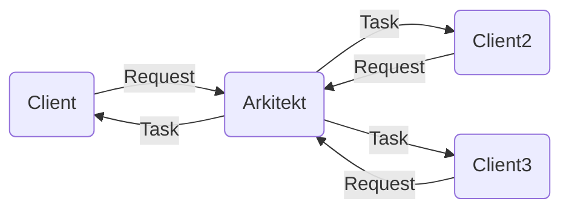

# Quick Start

Let's discover **Arkitekt in less than 5 minutes**.

### Core Ideas

Arkitekt tries to establish a protocol and implementation for the **reliable distribution** of tasks among **unsteady** workers.

### The why?

We developed arkitekt and the surrounding framework for our needs that arose in the context of
scientific image processing. We set out to design a workflow orchestration tool that can span multiple
image analysis tools on multiple participating computers. As a integral part of this we needed a solution
the distribution of this tasks to the participating tools. This is arkitekt. It establishes an API for a remote procedure
call (RPC) interface that has the following features:

- **Workers are Clients**: Workers are Clients (see Arkitekt vs other RPCs)
- **Workers are authenticated** Workers are Applications in the OAuth sense, that means they authenticate by User and Scope
- **Tasks are futures** Focussing on async programming, tasks are fully featured Futures (Tasks), that means you can also cancel (on another computer)
- **Tasks are abstract** Tasks can share the same logic (signature), but be implemented by different workers
- **Tasks are distributed** Tasks are automatically distributed amongst apps that share the same implementation

### Inspiration

Arkitekt tries to help in the automation of complex analysis pipelines. It is designed for task
distribution amongst **untrusted** and **unsteady** workes. What do we mean by this?

#### Arkitekt vs Celery

Arkitekt takes heavy inspiration from RPC Frameworks like Celery but has a completely different approach.
Whereas Celery tries to offload tasks on workers in the background of a server. Arkitekt tries to schedule
work on the clients conneted to said worker.

**Celery**:



**Arkitekt**:



### Trust Issues

With this sort of layout comes one essential problem.. **Trust!**

### Installation

```bash
pip install rath
```

## Initilization

```python
from rath.links.aiohttp import AioHttpLink

link = AioHttpLink(url="https://api.spacex.land/graphql/")


rath = Rath(link=link)

query = """query TestQuery {
  capsules {
    id
    missions {
      flight
    }
  }
}
"""

result = rath.execute(query)
```
