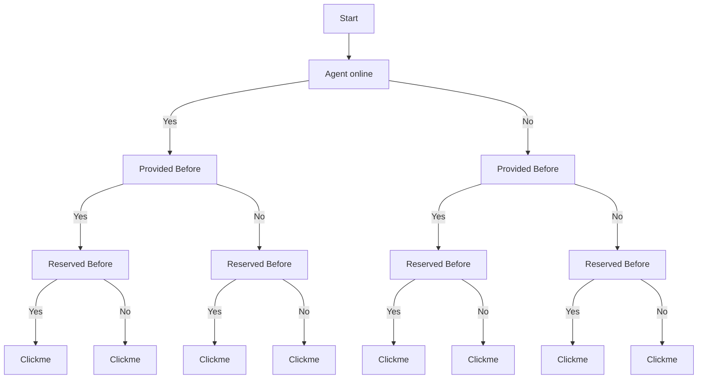

# Design

Arkitekt provides to major abstractions for your clients.
**Provisions** and **Reservation**

## Reservations

**Reservations** are contracts that you have with arkitekt. They describe
which node you want to use with what parallelization strategy.

#### For example:

You have a connected app that _provides_ a node to convolve an image. In order
to use it you first _reserve_ that node and then you can _assign_ tasks to it.

## Provisions

**Provisions** are contracts that you need to fullfill as a client app.
If you register to be able to provide for a nodeyou need to listen to the waiter endpoint and accept provisions and mark them active.

:::tip
You can of course decide to never register templates and use the
app as a pure client. But if you do, you should make sure you fullfill your
provisions.
:::

## Decision Tree for Protocol

