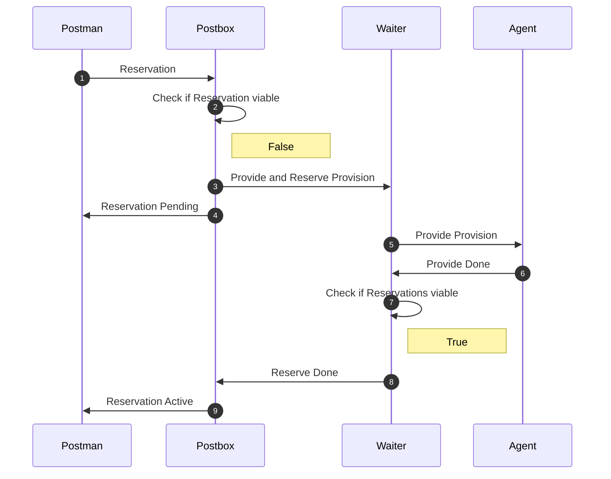

# First Reservation no provision active app

### Scenario

In this scenario arktitekt is as vanilla as it gets. You just
started an app (and started listening for provide requests (by running
the agent). Nobody has ever created a provision and somebody
tries to reserve this app.

### Checklist

- [ ] Reserved before
- [ ] Provided before
- [x] Active App

#### Scenario I (First Reservation (no provision))

