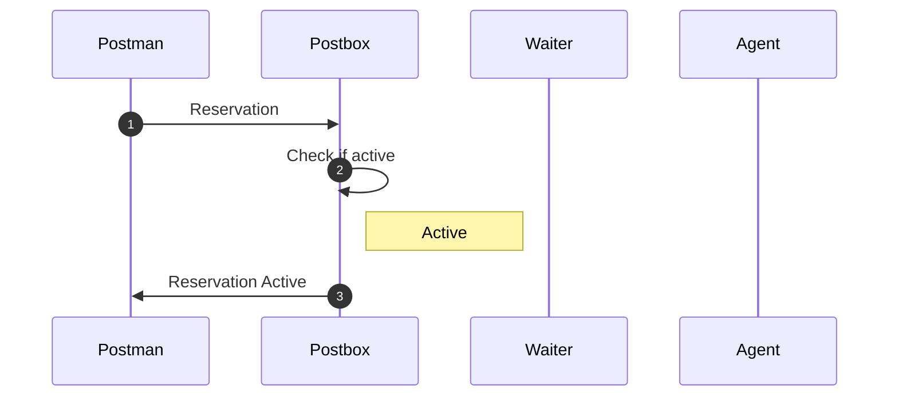

# First Reservation no provision active app

### Scenario

In this scenario you have already reserved a node before and the app is active

### Checklist

- [x] Reserved before
- [x] Provided before
- [x] Active App

#### Scenario I (First Reservation (already active provision))

