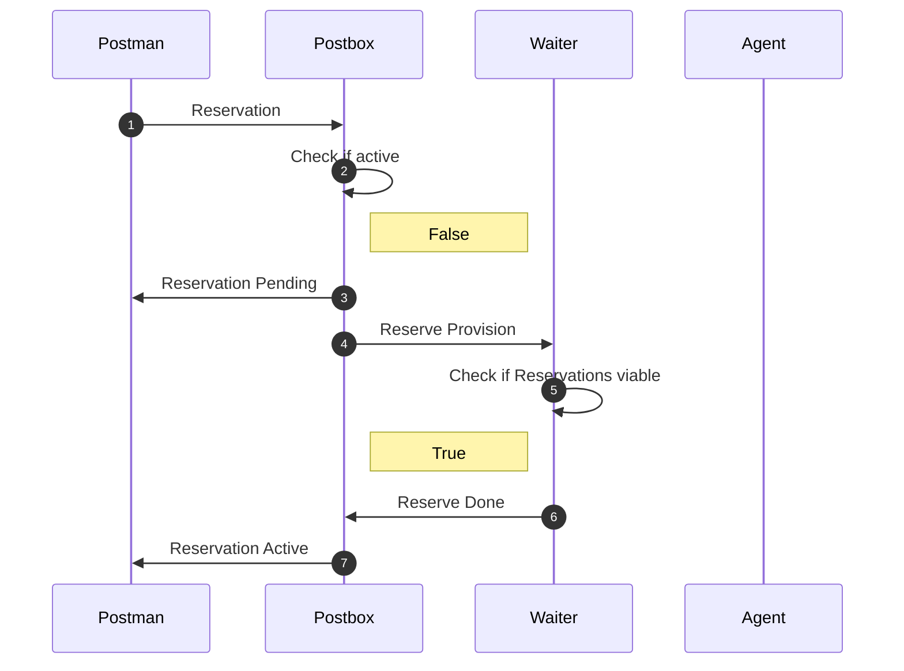

# First Reservation no provision active app

### Scenario

In this scenario you or somebody else has already caused arkitekt to
create a provision of a specific node. Now you want to reserve that provision
with a specific set of parameters.

### Checklist

- [ ] Reserved before
- [x] Provided before
- [x] Active App

#### Scenario I (First Reservation (already active provision))

