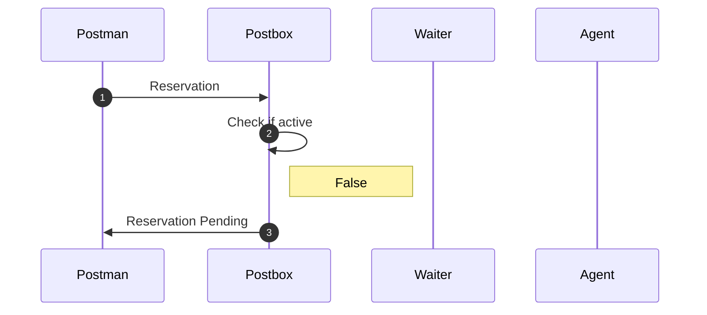
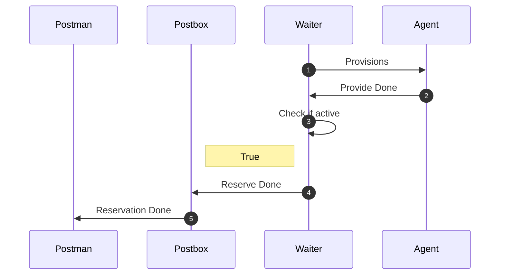

# First Reservation of unactive provision

### Scenario

In this scenario you or somebody else has already caused arkitekt to
create a provision of a specific node. Now you want to reserve that provision
with a specific set of parameters.

Later after Agent connects

