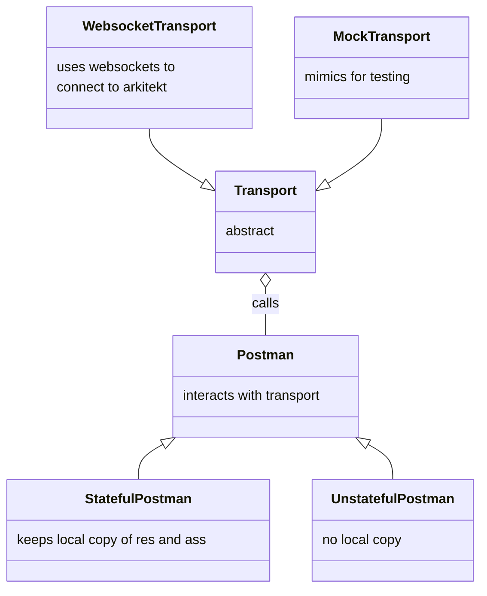

```mermaid
classDiagram
    class Transport {
        abstract
    }
    class WebsocketTransport {
        uses websockets to
        connect to arkitekt
    }
    class MockTransport {
        mimics for testing
    }

    WebsocketTransport --|> Transport
    MockTransport --|> Transport
    class Postman {
        interacts with transport
    }
    Transport o-- Postman : calls
    Postman <|-- StatefulPostman
    Postman <|-- UnstatefulPostman
    StatefulPostman: keeps local copy of res and ass
    UnstatefulPostman: no local copy
```

```mermaid
classDiagram
    class Transport {
        abstract
    }
    class WebsocketTransport {
        uses websockets to
        connect to arkitekt
    }
    class MockTransport {
        mimics for testing
    }

    WebsocketTransport --|> Transport
    MockTransport --|> Transport
    class Postman {
        interacts with transport
    }
    Transport o-- Postman : calls
    Postman <|-- StatefulPostman
    Postman <|-- UnstatefulPostman
    StatefulPostman: keeps local copy of res and ass
    UnstatefulPostman: no local copy
```
